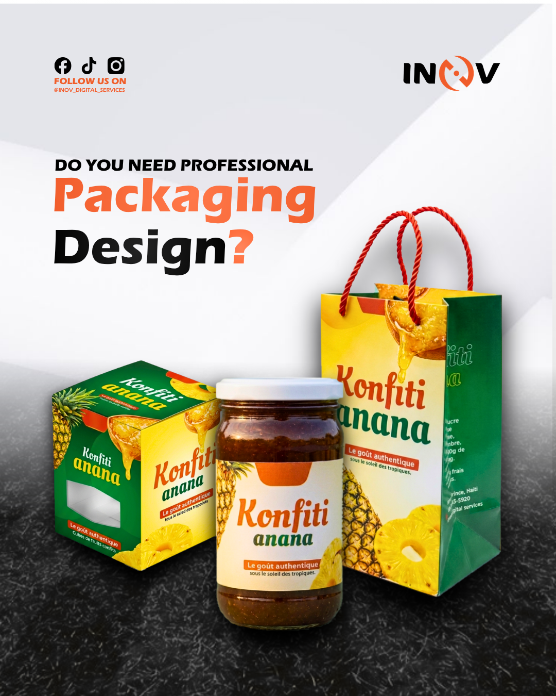
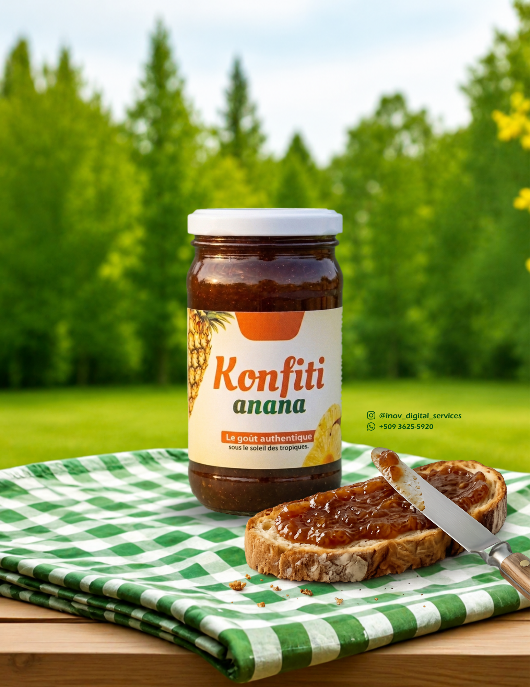
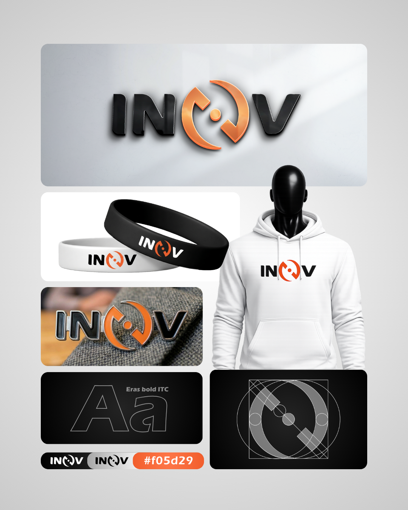
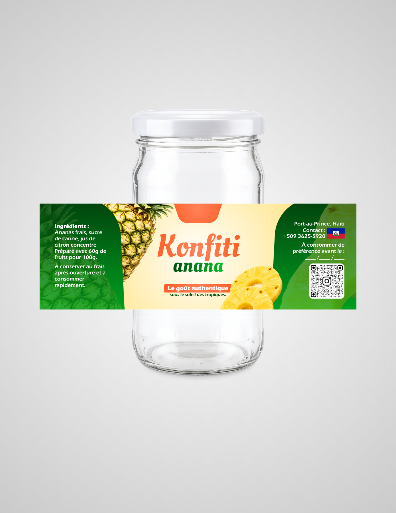
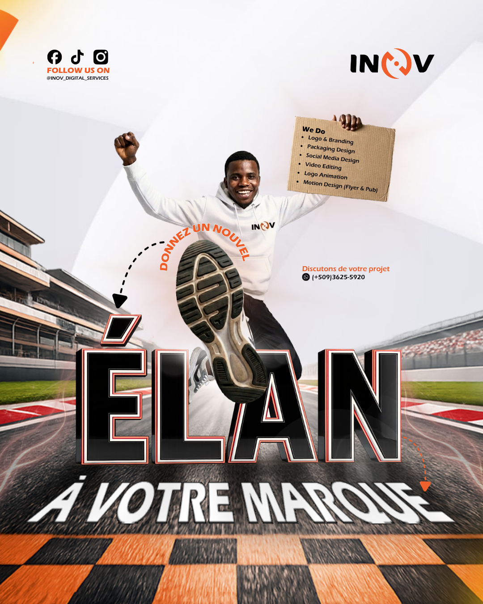

<!DOCTYPE html>
<html lang="fr">
<head>
  <meta charset="UTF-8">
  <meta name="viewport" content="width=device-width, initial-scale=1.0">

  <!-- SEO Meta Tags -->
  <title>INOV Digital Services — Agence Créative & Marketing Digital</title>
  <meta name="description" content="INOV Digital Services est une agence créative spécialisée en branding, création de logo, animation, montage vidéo, motion design, packaging et marketing digital. Design premium, résultats concrets.">
  <meta name="keywords" content="agence créative, branding, logo, animation logo, montage vidéo, motion design, packaging, marketing digital, promotion en ligne">
  <meta name="author" content="INOV Digital Services">

  <!-- Open Graph -->
  <meta property="og:title" content="INOV Digital Services — Agence Créative & Marketing Digital">
  <meta property="og:description" content="Transformez votre vision en réalité digitale. Design premium, résultats concrets.">
  <meta property="og:type" content="website">
  <meta property="og:image" content="assets/hero_bg.png">

  <!-- Favicon -->
  <link rel="icon" type="image/svg+xml" href="data:image/svg+xml,<svg xmlns='http://www.w3.org/2000/svg' viewBox='0 0 100 100'><rect width='100' height='100' rx='20' fill='%237c3aed'/><text y='.9em' font-size='70' x='50%25' dominant-baseline='middle' text-anchor='middle' fill='white' font-weight='900' font-family='Arial'>I</text></svg>">

  <!-- Google Fonts -->
  <link rel="preconnect" href="https://fonts.googleapis.com">
  <link rel="preconnect" href="https://fonts.gstatic.com" crossorigin>
  <link href="https://fonts.googleapis.com/css2?family=Outfit:wght@300;400;500;600;700;800;900&family=Space+Grotesk:wght@300;400;500;600;700&display=swap" rel="stylesheet">

  <!-- Stylesheet -->
  <link rel="stylesheet" href="css/style.css?v=2.0.1">
  <!-- PDF Generation -->
  
</head>
<body>

<!-- ================================================================
     NAVIGATION
================================================================ -->
<nav class="nav" id="navbar">
  

    

    <ul class="nav-links">
      <li><a href="#services" data-i18n="nav.services">Services</a></li>
      <li><a href="#why-us" data-i18n="nav.why">Pourquoi nous</a></li>
      <li><a href="#pricing" data-i18n="nav.pricing">Tarifs</a></li>
      <li><a href="#portfolio" data-i18n="nav.portfolio">Portfolio</a></li>
      <li><a href="#contact" data-i18n="nav.contact">Contact</a></li>
    </ul>

    

      

        <button class="lang-btn active" data-lang="fr">FR</button>
        <button class="lang-btn" data-lang="en">EN</button>
      

      <a href="#contact" class="btn btn-primary btn-sm" data-i18n="nav.cta">Démarrer un projet</a>
    

    <button class="nav-hamburger" id="hamburger" aria-label="Menu">
      
    </button>
  

</nav>

<!-- Mobile Menu -->

  <a href="#services" data-i18n="nav.services">Services</a>
  <a href="#why-us" data-i18n="nav.why">Pourquoi nous</a>
  <a href="#pricing" data-i18n="nav.pricing">Tarifs</a>
  <a href="#portfolio" data-i18n="nav.portfolio">Portfolio</a>
  <a href="#contact" data-i18n="nav.contact">Contact</a>
  <a href="#contact" class="btn btn-primary" data-i18n="nav.cta">Démarrer un projet</a>

<!-- ================================================================
     HERO SECTION (SIMPLIFIÉE & ÉPURÉE)
================================================================ -->
<section class="hero" id="home">
  

  

    

      🚀 AGENCE CRÉATIVE & DIGITALE
    

    <h1 class="hero-title">
      Design Premium &  
      Solutions Digitales Sur-Mesure
    </h1>

    

      INOV Digital Services propulse votre marque avec des visuels percutants, du branding haut de gamme et des campagnes marketing digitales axées sur les résultats.
    

    

      <a href="#pricing" class="btn btn-primary btn-lg" id="hero-cta1">
        ⚡ Voir les Tarifs & Commander
      </a>
      <a href="#portfolio" class="btn btn-secondary btn-lg" id="hero-cta2">
        👁️ Notre Portfolio
      </a>
    

    

      

        0+
        Projets Réalisés
      

      

        0+
        Clients Satisfaits
      

      

        0+
        Pays Servis
      

      

        0%
        Taux de Satisfaction
      

    

  

</section>

<!-- ================================================================
     SERVICES SECTION
================================================================ -->
<section class="services" id="services">
  

    

      
Nos Services

      <h2 class="section-title">
        Des solutions créatives pour votre
         croissance digitale
      </h2>
      

        Du branding à la promotion en ligne, nous offrons une gamme complète de services pour propulser votre marque.
      

    

    

      <!-- Service 1 -->
      

        <h3 class="service-title" data-i18n="s1.title">Branding & Identité</h3>
        
Création d'une identité visuelle forte et cohérente qui reflète les valeurs de votre marque.

      

      <!-- Service 2 -->
      

        <h3 class="service-title" data-i18n="s2.title">Création de Logo</h3>
        
Un logo professionnel, mémorable et unique qui représente votre entreprise.

      

      <!-- Service 3 -->
      

        <h3 class="service-title" data-i18n="s3.title">Animation de Logo</h3>
        
Donnez vie à votre logo avec des animations fluides et percutantes.

      

      <!-- Service 4 -->
      

        <h3 class="service-title" data-i18n="s4.title">Montage Vidéo</h3>
        
Montage professionnel pour vos vidéos promotionnelles, clips et contenus réseaux.

      

      <!-- Service 5 -->
      

        <h3 class="service-title" data-i18n="s5.title">Motion Design</h3>
        
Animations graphiques et effets visuels pour des contenus qui captivent.

      

      <!-- Service 6 -->
      

        <h3 class="service-title" data-i18n="s6.title">Packaging Design</h3>
        
Designs d'emballages attractifs qui boostent vos ventes en rayon et en ligne.

      

      <!-- Service 7 -->
      

        <h3 class="service-title" data-i18n="s7.title">Promotion en Ligne</h3>
        
Stratégies de promotion ciblées pour maximiser votre visibilité digitale.

      

      <!-- Service 8 -->
      

        <h3 class="service-title" data-i18n="s8.title">Marketing Digital</h3>
        
Campagnes de marketing digital complètes pour développer votre audience.

      

    

  

</section>

<!-- ================================================================
     WHY US SECTION
================================================================ -->
<section class="why-us" id="why-us">
  

    

      

        
Pourquoi INOV ?

        <h2 class="section-title" data-i18n="why.title">Ce qui nous distingue de la concurrence</h2>
        
Nous ne créons pas juste du design — nous créons des expériences qui convertissent.

        

          

            

              <h4 data-i18n="f1.title">Design Premium</h4>
              
Chaque projet est traité avec un soin extrême pour un rendu professionnel et moderne.

            

          

          

            

              <h4 data-i18n="f2.title">Livraison Rapide</h4>
              
Nous respectons vos délais et livrons dans les temps, sans compromis sur la qualité.

            

          

          

            

              <h4 data-i18n="f3.title">Support Continu</h4>
              
Nous restons disponibles après livraison pour toute modification ou question.

            

          

        

      

      

        

          
          

            

              0+
              
Projets

            

            

              0+
              
Clients

            

            

              0%
              
Satisfaction

            

            

              0+
              
Pays

            

          

          <!-- Tools we use -->
          

            
Outils & Plateformes

            

              Adobe After Effects
              Premiere Pro
              Illustrator
              Photoshop
              Figma
              DaVinci Resolve
            

          

        

      

    

  

</section>

<!-- ================================================================
     PRICING / TARIFS SECTION — Sélection Interactive
================================================================ -->
<section class="pricing" id="pricing">
  

    

      
Tarifs

      <h2 class="section-title">Services de Conception Graphique</h2>
      
Des visuels professionnels pour booster votre image. Sélectionnez vos services et commandez en un clic.

    

    

      <!-- ====== TABLEAU DES SERVICES ====== -->
      

        

          
Tarifs des services de conception graphique

          
À partir de

        

        

          <!-- Généré dynamiquement par JS -->
        

        <!-- Option "Autre" -->
        

          

            <input type="checkbox" class="tarifs-checkbox" id="other-checkbox" onchange="toggleOther()">
            

              <strong>Autre — Conception spécifique</strong>
              <input type="text" class="tarifs-other-input" id="other-input" placeholder="Décrivez votre projet ici..." oninput="updateCart()" disabled>
            

          

          
20 $US

        

        

          💡 Tous les prix sont affichés <strong>« à partir de »</strong> et peuvent varier selon les exigences ou les contraintes liées au service. Vous aurez vos conceptions sous <strong>12h à 3 jours</strong> à compter de la date du paiement.
        

      

      <!-- ====== PANIER SIDEBAR ====== -->
      

        

          

            🛒
            <h3>Votre Sélection</h3>
            0
          

          

            

              📋
              
Sélectionnez des services dans le tableau pour les ajouter ici

            

          

          

            

              Sous-total
              0 $US
            

            

              Réduction (0%)
              - 0 $US
            

            

              Total estimé
              0 $US
            

            

              Acompte (70%)
              0 $US
            

          

          <!-- Badges de réduction -->
          

            

              10%
              de réduction à partir de <strong>5 services</strong>
            

            

              30%
              de réduction à partir de <strong>10 services</strong>
            

          

          <!-- Champs de personnalisation client -->
          

            

              <label class="tarifs-client-label" for="devis-client-name">Nom du client / Entreprise</label>
              <input type="text" class="tarifs-client-input" id="devis-client-name" placeholder="Ex: Liberté Juridique" />
            

            

              <label class="tarifs-client-label" for="devis-num">N° de Proforma (généré automatiquement)</label>
              <input type="text" class="tarifs-client-input" id="devis-num" placeholder="Cliquez sur Télécharger le Devis..." readonly style="opacity:0.7;cursor:default;" />
            

          

          

            <button class="tarifs-btn tarifs-btn-whatsapp" onclick="commanderWhatsAppTarifs()">
              📲 Commander via WhatsApp
            </button>
            <button class="tarifs-btn tarifs-btn-devis" onclick="telechargerDevisPDF()">
              📥 Télécharger le Devis (PDF)
            </button>
          

          

            

              📞 (+509) 3625-5920
            

            

              📷 @inov_digital_services
            

            

              MonCash
              NatCash
              2Checkout
              CamTransfert
            

          

        

      

    

  

</section>

<!-- ================================================================
     MODÈLE PDF CACHÉ — Proforma dynamique
================================================================ -->

  

    <!-- Contenu principal -->
    

      <!-- En-tête -->
      

        
        

          
Facture Proforma

          

            N° PF-2026-0001&nbsp;|&nbsp;Offre valable 30 jours
          

        

      

      <!-- Meta grille client / date -->
      

        

          
Au nom de

          
Client

        

        

          
Date

          

        

      

      <!-- Tableau des services -->
      <table style="width:100%;border-collapse:collapse;border:2px solid #000;margin-bottom:14px;">
        <thead>
          <tr>
            <th style="background:#e5e5e5;color:#000;font-weight:800;font-size:11px;text-transform:uppercase;padding:11px 14px;border:1px solid #000;text-align:left;">Nom du service ou produit</th>
            <th style="background:#ff5500;color:#fff;font-weight:800;font-size:11px;text-transform:uppercase;padding:11px 14px;border:1px solid #000;text-align:right;width:120px;">Prix</th>
          </tr>
        </thead>
        <tbody id="pdf-services-body"></tbody>
      </table>

      <!-- Badges de réduction -->
      

        

          ✨ 10% de réduction appliquée (5+ services)
        

        

          🔥 30% de réduction appliquée (10+ services)
        

      

      <!-- Pied de page -->
      

        

          
📷 @inov_digital_services

          
📞 (+509) 3625-5920

          
✉️ inov01contact@gmail.com

        

        

          

            
Total

            
0 $ US

          

          

          

            
Acompte 70%

            
0 $ US

          

        

      

      <!-- Mentions légales -->
      

        INOV Digital Services — Port-au-Prince, Haïti — Tous droits réservés © 2025
      

    

  

<!-- ================================================================
     PORTFOLIO SECTION
================================================================ -->
<section class="portfolio" id="portfolio">
  

    

      
Portfolio

      <h2 class="section-title" data-i18n="portfolio.title">Quelques-unes de nos réalisations</h2>
      
Chaque projet est unique, conçu sur mesure pour nos clients.

    

    <!-- Filtres du portfolio -->
    

      <button class="portfolio-filter-btn active" onclick="filtrerPortfolio('all', this)">Tous</button>
      <button class="portfolio-filter-btn" onclick="filtrerPortfolio('packaging', this)">Packaging &amp; Étiquettes</button>
      <button class="portfolio-filter-btn" onclick="filtrerPortfolio('branding', this)">Branding &amp; Logo</button>
      <button class="portfolio-filter-btn" onclick="filtrerPortfolio('flyer', this)">Flyers &amp; Affiches</button>
    

    

      

        
        

          <h4>Packaging Design Pro</h4>
          
Konfiti Anana — Boîte, pot &amp; sac produit tropical

          <button class="btn btn-sm btn-secondary lightbox-trigger" style="margin-top:12px;" onclick="ouvrirLightbox('assets/portfolios/packaging_anana.png','Packaging Design Pro')">🔍 Voir le projet</button>
        

      

      

        
        

          <h4>Product Flyer &amp; Mockup</h4>
          
Konfiti Anana — Photo produit lifestyle &amp; étiquette sur-mesure

          <button class="btn btn-sm btn-secondary lightbox-trigger" style="margin-top:12px;" onclick="ouvrirLightbox('assets/portfolios/product_flyer.png','Product Flyer & Mockup')">🔍 Voir le projet</button>
        

      

      

        
        

          <h4>Logo Design &amp; Branding</h4>
          
Identité visuelle complète — logo, typographie, palette &amp; mockups

          <button class="btn btn-sm btn-secondary lightbox-trigger" style="margin-top:12px;" onclick="ouvrirLightbox('assets/portfolios/logo_branding.png','Logo Design & Branding')">🔍 Voir le projet</button>
        

      

      

        
        

          <h4>Conception d'Étiquette</h4>
          
Konfiti Anana — Étiquette pot avec ingrédients, QR code &amp; branding

          <button class="btn btn-sm btn-secondary lightbox-trigger" style="margin-top:12px;" onclick="ouvrirLightbox('assets/portfolios/etiquette_anana.png','Conception d\'Étiquette')">🔍 Voir le projet</button>
        

      

      

        
        

          <h4>Social Media Design</h4>
          
Flyer promotionnel dynamique — « Donnez un nouvel élan à votre marque »

          <button class="btn btn-sm btn-secondary lightbox-trigger" style="margin-top:12px;" onclick="ouvrirLightbox('assets/portfolios/social_flyer.png','Social Media Design')">🔍 Voir le projet</button>
        

      

      

        
        

          <h4>Affiche Événementielle</h4>
          
Cérémonie de remise de certificats — Parrots Modern Language School

          <button class="btn btn-sm btn-secondary lightbox-trigger" style="margin-top:12px;" onclick="ouvrirLightbox('assets/portfolios/affiche_ceremonie.png','Affiche Événementielle')">🔍 Voir le projet</button>
        

      

    

    

      <a href="#contact" class="btn btn-secondary" id="portfolio-cta" data-i18n="portfolio.cta">Voir tout le portfolio</a>
    

  

</section>

<!-- ================================================================
     TESTIMONIALS / TÉMOIGNAGES CLIENTS
================================================================ -->
<section class="testimonials" id="testimonials">
  

    

      
Avis Clients

      <h2 class="section-title">Ce que nos clients disent de nous</h2>
      
Découvrez les retours de marques et entreprises qui nous ont fait confiance.

    

    

      

        
★★★★★

        
« INOV Digital Services a conçu l'emballage et les étiquettes de nos produits de manière exceptionnelle. La réactivité et le professionnalisme sont au rendez-vous ! »

        

          
K

          

            <h4>Konfiti Anana</h4>
            
Marque Agroalimentaire — Haïti

          

        

      

      

        
★★★★★

        
« Leur travail sur notre branding complet et nos affiches événementielles a considérablement amélioré notre visibilité auprès des étudiants. »

        

          
P

          

            <h4>Parrots Modern Language</h4>
            
Centre de Langues — Éducation

          

        

      

      

        
★★★★★

        
« Le devis PDF instantané et la commande rapide via WhatsApp m'ont fait gagner un temps précieux. Les visuels créés dépassent nos attentes. »

        

          
L

          

            <h4>Liberté Juridique</h4>
            
Cabinet de Conseil

          

        

      

    

  

</section>

<!-- ================================================================
     FAQ ACCORDION (FOIRE AUX QUESTIONS)
================================================================ -->
<section class="faq-section" id="faq">
  

    

      
FAQ

      <h2 class="section-title">Questions Fréquentes</h2>
      
Tout ce que vous devez savoir avant de démarrer votre projet.

    

    

      

        <button class="faq-question" onclick="toggleFAQ(this)">
          Quels sont les délais de livraison pour un projet ?
          ▼
        </button>
        

          
Nos délais de livraison varient de <strong>12 heures à 3 jours ouvrisés</strong> à compter de la date du paiement de l'acompte, selon la complexité et le volume des services sélectionnés.

        

      

      

        <button class="faq-question" onclick="toggleFAQ(this)">
          Comment fonctionne le paiement de l'acompte de 70% ?
          ▼
        </button>
        

          
Pour lancer la création, un acompte de 70% du montant total est requis à la commande. Le solde de 30% est réglé à la livraison finale des fichiers HD valides.

        

      

      

        <button class="faq-question" onclick="toggleFAQ(this)">
          Quels modes de paiement acceptez-vous ?
          ▼
        </button>
        

          
Nous acceptons <strong>MonCash</strong>, <strong>NatCash</strong>, <strong>2Checkout</strong> (Visa, Mastercard, PayPal), et <strong>CamTransfert</strong>.

        

      

      

        <button class="faq-question" onclick="toggleFAQ(this)">
          Dans quels formats recevrai-je mes visuels ?
          ▼
        </button>
        

          
Vous recevrez tous les formats professionnels nécessaires : <strong>PNG haute définition (fond transparent), JPEG, PDF prêt à l'impression et fichiers sources (AI, PSD, SVG)</strong> selon le pack souscrit.

        

      

    

  

</section>

<!-- ================================================================
     LIGHTBOX PORTFOLIO
================================================================ -->

  

  
  

    <button class="lightbox-btn lightbox-btn-zoom" onclick="toggleZoomLightbox()">🔍 Zoom</button>
    <button class="lightbox-btn lightbox-btn-download" onclick="telechargerImageLightbox()">📥 Télécharger</button>
    <button class="lightbox-btn lightbox-btn-close" onclick="fermerLightbox()">✕ Fermer</button>
  

  

<!-- ================================================================
     CONTACT SECTION
================================================================ -->
<section class="contact" id="contact">
  

    

      

        
Contact

        <h2 class="section-title" data-i18n="contact.title">Parlons de votre projet</h2>
        
Vous avez un projet en tête ? Contactez-nous et obtenez un devis gratuit sous 24h.

        

          

            

              Email
              inov01contact@gmail.com
            

          

          

            

              WhatsApp
              (+509) 3625-5920
            

          

          

            

              Localisation
              Port-au-Prince, Haïti
            

          

          

            

              Réponse
              Sous 24h garanties
            

          

        

        <!-- Social -->
        

          <a href="https://linktr.ee/inovdigitalservices" class="btn btn-secondary btn-sm" target="_blank" rel="noopener">Linktree Officiel</a>
          <a href="https://wa.me/50936255920" class="btn btn-secondary btn-sm" target="_blank" rel="noopener">WhatsApp</a>
          <a href="https://instagram.com/inov_digital_services" class="btn btn-secondary btn-sm" target="_blank" rel="noopener">Instagram</a>
          <a href="https://tiktok.com/@inovdigitalservices" class="btn btn-secondary btn-sm" target="_blank" rel="noopener">TikTok</a>
          <a href="https://facebook.com/inov01design" class="btn btn-secondary btn-sm" target="_blank" rel="noopener">Facebook</a>
        

        
        

          <a href="https://linktr.ee/inovdigitalservices" target="_blank" rel="noopener" class="btn btn-secondary btn-sm" style="width: 100%; justify-content: center;">
            Voir tous nos réseaux (Linktree Officiel)
          </a>
        

      

      

        <h3 style="font-size:1.4rem; margin-bottom:8px; color: #ffffff;">Envoyez-nous un message</h3>
        
Réponse garantie sous 24h

        <form id="contact-form" novalidate>
          

            

              <label class="form-label" for="contact-name" data-i18n="form.name" style="color: #ffffff;">Votre nom</label>
              <input type="text" id="contact-name" name="name" class="form-control" placeholder="Jean Dupont" required data-i18n-placeholder="form.name">
            

            

              <label class="form-label" for="contact-email" data-i18n="form.email" style="color: #ffffff;">Adresse email</label>
              <input type="email" id="contact-email" name="email" class="form-control" placeholder="jean@exemple.com" required>
            

          

          

            

              <label class="form-label" for="contact-service" data-i18n="form.service" style="color: #ffffff;">Service souhaité</label>
              <select id="contact-service" name="service" class="form-control">
                <option value="">-- Sélectionner --</option>
                <option>Logo & Identité Visuelle</option>
                <option>Cartes de Visite</option>
                <option>Étiquettes & Packaging Design</option>
                <option>Conception Réseaux Sociaux</option>
                <option>Conception Impression (Petit/Grand format)</option>
                <option>Montage Vidéo & Animation</option>
                <option>Promotion Réseaux Sociaux</option>
                <option>Autre / Projet spécifique</option>
              </select>
            

            

              <label class="form-label" for="contact-budget" data-i18n="form.budget" style="color: #ffffff;">Budget estimé</label>
              <select id="contact-budget" name="budget" class="form-control">
                <option value="">-- Sélectionner --</option>
                <option>Moins de $50</option>
                <option>$50 – $100</option>
                <option>$100 – $300</option>
                <option>$300 – $500</option>
                <option>$500+</option>
                <option>À discuter</option>
              </select>
            

          

          

            <label class="form-label" for="contact-message" style="color: #ffffff;">Message</label>
            <textarea id="contact-message" name="message" class="form-control" placeholder="Décrivez votre projet..." data-i18n-placeholder="form.message" required></textarea>
          

          <button type="submit" class="btn btn-secondary" id="form-submit" style="width:100%; justify-content:center; border-radius: var(--radius-md); padding: 16px; background: #ffffff; color: #000000; border: none;" data-i18n="form.submit">
            Envoyer le message
          </button>
        </form>
      

    

  

</section>

<!-- ================================================================
     FOOTER
================================================================ -->
<footer class="footer">
  

    

      

        
        
Votre partenaire créatif pour un digital impactant. Design premium, résultats concrets. Port-au-Prince, Haïti.

        

          <a href="https://linktr.ee/inovdigitalservices" target="_blank" rel="noopener" style="color: #ffffff; text-decoration: none; font-size: 0.85rem; font-weight: 600;">Linktree</a>
          <a href="https://wa.me/50936255920" target="_blank" rel="noopener" style="color: #ffffff; text-decoration: none; font-size: 0.85rem; font-weight: 600;">WhatsApp</a>
          <a href="https://instagram.com/inov_digital_services" target="_blank" rel="noopener" style="color: #ffffff; text-decoration: none; font-size: 0.85rem; font-weight: 600;">Instagram</a>
          <a href="https://tiktok.com/@inovdigitalservices" target="_blank" rel="noopener" style="color: #ffffff; text-decoration: none; font-size: 0.85rem; font-weight: 600;">TikTok</a>
        

      

      

        <h4>Services</h4>
        <ul class="footer-links">
          <li><a href="#services">Branding & Identité</a></li>
          <li><a href="#services">Création de Logo</a></li>
          <li><a href="#services">Animation de Logo</a></li>
          <li><a href="#services">Montage Vidéo</a></li>
          <li><a href="#services">Motion Design</a></li>
        </ul>
      

      

        <h4>Plus de services</h4>
        <ul class="footer-links">
          <li><a href="#services">Packaging Design</a></li>
          <li><a href="#services">Promotion en Ligne</a></li>
          <li><a href="#services">Marketing Digital</a></li>
          <li><a href="#pricing">Nos Tarifs</a></li>
          <li><a href="#portfolio">Portfolio</a></li>
        </ul>
      

      

        <h4>Contact & Réseaux</h4>
        <ul class="footer-links">
          <li><a href="https://linktr.ee/inovdigitalservices" target="_blank" rel="noopener">Linktree Officiel</a></li>
          <li><a href="mailto:inov01contact@gmail.com">inov01contact@gmail.com</a></li>
          <li><a href="https://wa.me/50936255920" target="_blank" rel="noopener">(+509) 3625-5920</a></li>
          <li><a href="https://instagram.com/inov_digital_services" target="_blank" rel="noopener">@inov_digital_services</a></li>
          <li><a href="https://tiktok.com/@inovdigitalservices" target="_blank" rel="noopener">@inovdigitalservices</a></li>
        </ul>
      

    

    

      © 2025 <strong>INOV Digital Services</strong>. Tous droits réservés.
      

        <a href="#">Politique de confidentialité</a>
        <a href="#">Conditions d'utilisation</a>
      

    

  

</footer>

<!-- ================================================================
     PAYMENT MODAL
================================================================ -->

  

    <button class="modal-close" aria-label="Fermer">✕</button>

    <h3 class="gradient-text">Choisissez votre mode de paiement</h3>
    
Paiement 100% sécurisé — Confirmation directe via WhatsApp / Email

    

      

        
Service

        
Prix

      

    

    

      <!-- MonCash -->
      <a href="https://wa.me/50936255920?text=Bonjour%20INOV,%20je%20souhaite%20payer%20via%20MonCash" class="payment-option-btn" id="pay-moncash" target="_blank" rel="noopener">
        MonCash
        Paiement Mobile Haïti
      </a>

      <!-- NatCash -->
      <a href="https://wa.me/50936255920?text=Bonjour%20INOV,%20je%20souhaite%20payer%20via%20NatCash" class="payment-option-btn" id="pay-natcash" target="_blank" rel="noopener">
        NatCash
        Paiement Mobile Haïti
      </a>

      <!-- 2Checkout -->
      <a href="https://wa.me/50936255920?text=Bonjour%20INOV,%20je%20souhaite%20payer%20via%202Checkout%20/ %20Carte" class="payment-option-btn" id="pay-2checkout" target="_blank" rel="noopener">
        2Checkout
        Visa, Mastercard, PayPal
      </a>

      <!-- CamTransfert -->
      <a href="https://wa.me/50936255920?text=Bonjour%20INOV,%20je%20souhaite%20payer%20via%20CamTransfert" class="payment-option-btn" id="pay-camtransfert" target="_blank" rel="noopener">
        CamTransfert
        Transfert Cameroun & International
      </a>

      <!-- WhatsApp (fallback) -->
      <a href="https://wa.me/50936255920?text=Bonjour%20INOV%20Digital%20Services,%20je%20souhaite%20commander%20un%20service" class="payment-option-btn" id="pay-whatsapp" target="_blank" rel="noopener" style="grid-column: span 2;">
        WhatsApp Direct
        Commander et négocier directement sur WhatsApp
      </a>
    

    

      Après votre paiement, envoyez-nous la capture du reçu sur WhatsApp au (+509) 3625-5920. Votre commande est confirmée immédiatement.
    

  

<!-- WhatsApp Floating Button -->

  <a href="https://wa.me/50936255920?text=Bonjour%20INOV%20Digital%20Services,%20je%20voudrais%20un%20devis" target="_blank" rel="noopener" aria-label="Contacter par WhatsApp">
    <svg width="20" height="20" viewBox="0 0 24 24" fill="currentColor">
      <path d="M17.472 14.382c-.297-.149-1.758-.867-2.03-.967-.273-.099-.471-.148-.67.15-.197.297-.767.966-.94 1.164-.173.199-.347.223-.644.075-.297-.15-1.255-.463-2.39-1.475-.883-.788-1.48-1.761-1.653-2.059-.173-.297-.018-.458.13-.606.134-.133.298-.347.446-.52.149-.174.198-.298.298-.497.099-.198.05-.371-.025-.52-.075-.149-.669-1.612-.916-2.207-.242-.579-.487-.5-.669-.51-.173-.008-.371-.01-.57-.01-.198 0-.52.074-.792.372-.272.297-1.04 1.016-1.04 2.479 0 1.462 1.065 2.875 1.213 3.074.149.198 2.096 3.2 5.077 4.487.709.306 1.262.489 1.694.625.712.227 1.36.195 1.871.118.571-.085 1.758-.719 2.006-1.413.248-.694.248-1.289.173-1.413-.074-.124-.272-.198-.57-.347m-5.421 7.403h-.004a9.87 9.87 0 01-5.031-1.378l-.361-.214-3.741.982.998-3.648-.235-.374a9.86 9.86 0 01-1.51-5.26c.001-5.45 4.436-9.884 9.888-9.884 2.64 0 5.122 1.03 6.988 2.898a9.825 9.825 0 012.893 6.994c-.003 5.45-4.437 9.884-9.885 9.884m8.413-18.297A11.815 11.815 0 0012.05 0C5.495 0 .16 5.335.157 11.892c0 2.096.547 4.142 1.588 5.945L.057 24l6.305-1.654a11.882 11.882 0 005.683 1.448h.005c6.554 0 11.89-5.335 11.893-11.893a11.821 11.821 0 00-3.48-8.413z"/>
    </svg>
    WhatsApp
  </a>

<!-- Mobile Floating Cart Bar -->

  

    0 service(s) sélectionné(s)
    0 $US
  

  

    <button class="mobile-cart-btn mobile-cart-btn-pdf" onclick="telechargerDevisPDF()">📥 PDF</button>
    <button class="mobile-cart-btn mobile-cart-btn-wa" onclick="commanderWhatsAppTarifs()">📲 WhatsApp</button>
  

  /* ============================================================
   INOV DIGITAL SERVICES — Premium Design System
   ============================================================ */

@import url('https://fonts.googleapis.com/css2?family=Outfit:wght@300;400;500;600;700;800;900&family=Space+Grotesk:wght@300;400;500;600;700&display=swap');

/* ---- CSS Custom Properties (Noir et Blanc / High Contrast Black & White) ---- */
:root {
  --bg-primary: #ffffff;
  --bg-secondary: #f6f6f9;
  --bg-card: #ffffff;
  --bg-card-hover: #f0f0f5;

  --accent-black: #000000;
  --accent-dark: #121218;
  --accent-gray: #333340;
  --accent-light-gray: #e6e6ee;

  --gradient-primary: linear-gradient(135deg, #000000 0%, #22222c 100%);
  --gradient-hero: linear-gradient(135deg, #ffffff 0%, #f6f6f9 100%);
  --gradient-card: linear-gradient(135deg, rgba(0,0,0,0.02), rgba(0,0,0,0.05));
  --gradient-text: linear-gradient(90deg, #000000, #333340);

  --text-primary: #000000;
  --text-secondary: #4a4a58;
  --text-muted: #78788a;
  --text-on-dark: #ffffff;

  --border-color: rgba(0, 0, 0, 0.1);
  --border-accent: #000000;
  --glow-black: 0 10px 30px rgba(0, 0, 0, 0.15);

  --radius-sm: 8px;
  --radius-md: 16px;
  --radius-lg: 24px;
  --radius-xl: 32px;

  --transition: all 0.3s cubic-bezier(0.4, 0, 0.2, 1);
  --transition-slow: all 0.6s cubic-bezier(0.4, 0, 0.2, 1);

  --font-primary: 'Outfit', sans-serif;
  --font-secondary: 'Space Grotesk', sans-serif;

  --max-width: 1280px;
  --section-padding: 100px 24px;
}

/* ---- Reset & Base ---- */
*, *::before, *::after {
  margin: 0;
  padding: 0;
  box-sizing: border-box;
}

html {
  scroll-behavior: smooth;
  font-size: 16px;
}

body {
  font-family: var(--font-primary);
  background-color: var(--bg-primary);
  color: var(--text-primary);
  line-height: 1.6;
  overflow-x: hidden;
  cursor: default;
}

/* ---- Scrollbar ---- */
::-webkit-scrollbar { width: 6px; }
::-webkit-scrollbar-track { background: #ffffff; }
::-webkit-scrollbar-thumb { background: #000000; border-radius: 3px; }
::-webkit-scrollbar-thumb:hover { background: #33333e; }

/* ---- Typography ---- */
h1, h2, h3, h4, h5 {
  font-family: var(--font-primary);
  font-weight: 800;
  color: #000000;
  line-height: 1.15;
  letter-spacing: -0.02em;
}

.gradient-text {
  background: var(--gradient-text);
  -webkit-background-clip: text;
  -webkit-text-fill-color: transparent;
  background-clip: text;
}

.section-tag {
  display: inline-flex;
  align-items: center;
  gap: 8px;
  font-size: 0.8rem;
  font-weight: 700;
  letter-spacing: 0.15em;
  text-transform: uppercase;
  color: #000000;
  padding: 6px 16px;
  background: #ffffff;
  border: 1.5px solid #000000;
  border-radius: 100px;
  margin-bottom: 20px;
  box-shadow: 0 4px 15px rgba(0,0,0,0.05);
}

.section-tag::before {
  content: '';
  width: 6px;
  height: 6px;
  background: #000000;
  border-radius: 50%;
  animation: pulse-dot 2s infinite;
}

@keyframes pulse-dot {
  0%, 100% { opacity: 1; transform: scale(1); }
  50% { opacity: 0.5; transform: scale(0.8); }
}

.section-title {
  font-size: clamp(2rem, 5vw, 3.5rem);
  margin-bottom: 16px;
  color: #000000;
}

.section-subtitle {
  font-size: 1.1rem;
  color: var(--text-secondary);
  max-width: 600px;
  line-height: 1.7;
}

/* ---- Container ---- */
.container {
  max-width: var(--max-width);
  margin: 0 auto;
  padding: 0 24px;
}

/* ---- Buttons ---- */
.btn {
  display: inline-flex;
  align-items: center;
  gap: 10px;
  padding: 14px 32px;
  border-radius: 100px;
  font-family: var(--font-primary);
  font-size: 0.95rem;
  font-weight: 700;
  cursor: pointer;
  text-decoration: none;
  border: none;
  transition: var(--transition);
  position: relative;
  overflow: hidden;
  white-space: nowrap;
}

.btn-primary {
  background: #000000;
  color: #ffffff;
  box-shadow: 0 8px 25px rgba(0,0,0,0.25);
}

.btn-primary:hover {
  background: #22222a;
  transform: translateY(-3px);
  box-shadow: 0 14px 35px rgba(0,0,0,0.35);
}

.btn-secondary {
  background: #ffffff;
  color: #000000;
  border: 2px solid #000000;
  box-shadow: 0 4px 15px rgba(0,0,0,0.05);
}

.btn-secondary:hover {
  background: #000000;
  color: #ffffff;
  transform: translateY(-3px);
  box-shadow: 0 10px 25px rgba(0,0,0,0.2);
}

.btn-sm {
  padding: 10px 22px;
  font-size: 0.875rem;
}

.btn-payment {
  background: #000000;
  color: #ffffff;
  box-shadow: 0 8px 25px rgba(0,0,0,0.2);
  width: 100%;
  justify-content: center;
  border-radius: var(--radius-md);
}

.btn-payment:hover {
  background: #22222a;
  transform: translateY(-3px);
  box-shadow: 0 14px 35px rgba(0,0,0,0.35);
}

/* ---- Noise Overlay ---- */
body::after {
  content: '';
  position: fixed;
  inset: 0;
  background-image: url("data:image/svg+xml,%3Csvg viewBox='0 0 256 256' xmlns='http://www.w3.org/2000/svg'%3E%3Cfilter id='noise'%3E%3CfeTurbulence type='fractalNoise' baseFrequency='0.9' numOctaves='4' stitchTiles='stitch'/%3E%3C/filter%3E%3Crect width='100%25' height='100%25' filter='url(%23noise)' opacity='0.03'/%3E%3C/svg%3E");
  pointer-events: none;
  z-index: 9999;
  opacity: 0.4;
}

/* ---- Glow Orbs ---- */
.orb {
  position: absolute;
  border-radius: 50%;
  filter: blur(100px);
  pointer-events: none;
  animation: orb-float 8s ease-in-out infinite;
}

.orb-1 {
  width: 600px; height: 600px;
  background: radial-gradient(circle, rgba(124,58,237,0.2), transparent 70%);
  top: -200px; right: -200px;
}

.orb-2 {
  width: 400px; height: 400px;
  background: radial-gradient(circle, rgba(6,182,212,0.15), transparent 70%);
  bottom: -100px; left: -100px;
  animation-delay: -4s;
}

@keyframes orb-float {
  0%, 100% { transform: translate(0, 0); }
  33% { transform: translate(30px, -30px); }
  66% { transform: translate(-20px, 20px); }
}

/* ================================================================
   NAVIGATION
================================================================ */
.nav {
  position: fixed;
  top: 0;
  left: 0;
  right: 0;
  z-index: 1000;
  padding: 20px 0;
  transition: var(--transition);
}

.nav.scrolled {
  background: rgba(7,7,15,0.85);
  backdrop-filter: blur(20px);
  -webkit-backdrop-filter: blur(20px);
  border-bottom: 1px solid var(--border-color);
  padding: 14px 0;
  box-shadow: 0 4px 30px rgba(0,0,0,0.3);
}

.nav-inner {
  max-width: var(--max-width);
  margin: 0 auto;
  padding: 0 24px;
  display: flex;
  align-items: center;
  justify-content: space-between;
}

.nav-logo {
  display: flex;
  align-items: center;
  gap: 12px;
  text-decoration: none;
}

.nav-logo-icon {
  width: 42px;
  height: 42px;
  background: var(--gradient-primary);
  border-radius: var(--radius-sm);
  display: flex;
  align-items: center;
  justify-content: center;
  font-size: 1.2rem;
  font-weight: 800;
  color: white;
  box-shadow: var(--glow-purple);
  letter-spacing: -0.05em;
  position: relative;
  overflow: hidden;
}

.nav-logo-icon::after {
  content: '';
  position: absolute;
  inset: 0;
  background: linear-gradient(135deg, rgba(255,255,255,0.2), transparent);
}

.nav-logo-text {
  display: flex;
  flex-direction: column;
  line-height: 1;
}

.nav-logo-name {
  font-size: 1.1rem;
  font-weight: 800;
  color: var(--text-primary);
  letter-spacing: -0.03em;
}

.nav-logo-sub {
  font-size: 0.65rem;
  font-weight: 500;
  color: var(--accent-cyan);
  letter-spacing: 0.08em;
  text-transform: uppercase;
}

.nav-links {
  display: flex;
  align-items: center;
  gap: 36px;
  list-style: none;
}

.nav-links a {
  font-size: 0.9rem;
  font-weight: 500;
  color: var(--text-secondary);
  text-decoration: none;
  transition: var(--transition);
  position: relative;
}

.nav-links a::after {
  content: '';
  position: absolute;
  bottom: -4px;
  left: 0;
  width: 0;
  height: 2px;
  background: var(--gradient-primary);
  border-radius: 2px;
  transition: var(--transition);
}

.nav-links a:hover { color: var(--text-primary); }
.nav-links a:hover::after { width: 100%; }

.nav-actions {
  display: flex;
  align-items: center;
  gap: 12px;
}

.lang-toggle {
  display: flex;
  background: var(--bg-card);
  border: 1px solid var(--border-color);
  border-radius: 100px;
  padding: 3px;
  gap: 2px;
}

.lang-btn {
  padding: 6px 12px;
  border-radius: 100px;
  font-size: 0.75rem;
  font-weight: 600;
  cursor: pointer;
  border: none;
  background: transparent;
  color: var(--text-muted);
  transition: var(--transition);
}

.lang-btn.active {
  background: var(--gradient-primary);
  color: white;
}

/* Hamburger */
.nav-hamburger {
  display: none;
  flex-direction: column;
  gap: 5px;
  cursor: pointer;
  padding: 8px;
  border: none;
  background: none;
}

.nav-hamburger span {
  display: block;
  width: 24px;
  height: 2px;
  background: var(--text-primary);
  border-radius: 2px;
  transition: var(--transition);
}

.nav-hamburger.open span:nth-child(1) { transform: rotate(45deg) translate(5px, 5px); }
.nav-hamburger.open span:nth-child(2) { opacity: 0; }
.nav-hamburger.open span:nth-child(3) { transform: rotate(-45deg) translate(5px, -5px); }

/* Mobile Menu */
.nav-mobile {
  display: none;
  position: fixed;
  inset: 0;
  background: rgba(7,7,15,0.97);
  backdrop-filter: blur(20px);
  z-index: 999;
  flex-direction: column;
  align-items: center;
  justify-content: center;
  gap: 32px;
}

.nav-mobile.open { display: flex; }

.nav-mobile a {
  font-size: 2rem;
  font-weight: 700;
  color: var(--text-primary);
  text-decoration: none;
  transition: var(--transition);
}

.nav-mobile a:hover { color: var(--accent-purple-light); }

/* ================================================================
   HERO SECTION (SIMPLIFIÉE & ÉPURÉE)
================================================================ */
.hero {
  min-height: 85vh;
  display: flex;
  align-items: center;
  position: relative;
  overflow: hidden;
  padding: 130px 24px 70px;
  background: linear-gradient(180deg, #ffffff 0%, #f6f6f9 100%);
}

.hero-bg {
  position: absolute;
  inset: 0;
  background: radial-gradient(circle at 80% 20%, rgba(255,85,0,0.06) 0%, transparent 50%);
  z-index: 0;
}

.hero-content {
  position: relative;
  z-index: 10;
  max-width: var(--max-width);
  margin: 0 auto;
  width: 100%;
}

.hero-badge {
  display: inline-flex;
  align-items: center;
  gap: 8px;
  padding: 8px 18px;
  background: #000000;
  border-radius: 100px;
  font-size: 0.75rem;
  font-weight: 700;
  color: #ffffff;
  margin-bottom: 24px;
  letter-spacing: 0.08em;
}

.hero-badge span { color: #ff5500; }

.hero-title {
  font-size: clamp(2.2rem, 5.5vw, 4.2rem);
  font-weight: 900;
  line-height: 1.12;
  margin-bottom: 20px;
  max-width: 920px;
  color: #000000;
  letter-spacing: -0.02em;
}

.hero-orange-text {
  color: #ff5500;
  position: relative;
  display: inline-block;
}

.hero-description {
  font-size: clamp(1rem, 2vw, 1.2rem);
  color: #4a4a58;
  max-width: 620px;
  line-height: 1.7;
  margin-bottom: 36px;
  font-weight: 500;
}

.hero-actions {
  display: flex;
  gap: 16px;
  flex-wrap: wrap;
  align-items: center;
}

.btn-lg {
  padding: 16px 32px;
  font-size: 1rem;
  border-radius: 12px;
  font-weight: 800;
}

.hero-stats {
  display: grid;
  grid-template-columns: repeat(auto-fit, minmax(140px, 1fr));
  gap: 24px;
  margin-top: 56px;
  padding-top: 36px;
  border-top: 1px solid var(--border-color);
  max-width: 900px;
}

.stat-item {
  display: flex;
  flex-direction: column;
}

.stat-number {
  font-size: 2.2rem;
  font-weight: 900;
  color: #000000;
  line-height: 1;
}

.stat-label {
  font-size: 0.8rem;
  font-weight: 600;
  color: var(--text-muted);
  margin-top: 6px;
  text-transform: uppercase;
  letter-spacing: 0.04em;
}

/* Scroll indicator */
.scroll-indicator {
  position: absolute;
  bottom: 40px;
  left: 50%;
  transform: translateX(-50%);
  z-index: 10;
  display: flex;
  flex-direction: column;
  align-items: center;
  gap: 8px;
  animation: fade-in-up 1s ease 1s both;
}

.scroll-mouse {
  width: 26px;
  height: 42px;
  border: 2px solid rgba(255,255,255,0.3);
  border-radius: 13px;
  display: flex;
  justify-content: center;
  padding-top: 6px;
}

.scroll-wheel {
  width: 4px;
  height: 8px;
  background: var(--accent-cyan);
  border-radius: 2px;
  animation: scroll-anim 2s ease-in-out infinite;
}

@keyframes scroll-anim {
  0% { transform: translateY(0); opacity: 1; }
  100% { transform: translateY(14px); opacity: 0; }
}

.scroll-text {
  font-size: 0.7rem;
  color: var(--text-muted);
  letter-spacing: 0.1em;
  text-transform: uppercase;
}

/* ================================================================
   SERVICES SECTION
================================================================ */
.services {
  padding: var(--section-padding);
  position: relative;
}

.services-header {
  text-align: center;
  margin-bottom: 72px;
}

.services-grid {
  display: grid;
  grid-template-columns: repeat(auto-fit, minmax(280px, 1fr));
  gap: 24px;
}

.service-card {
  background: var(--bg-card);
  border: 1px solid var(--border-color);
  border-radius: var(--radius-lg);
  padding: 36px 32px;
  transition: var(--transition);
  position: relative;
  overflow: hidden;
  cursor: default;
  group: true;
}

.service-card::before {
  content: '';
  position: absolute;
  inset: 0;
  background: var(--gradient-card);
  opacity: 0;
  transition: var(--transition);
}

.service-card::after {
  content: '';
  position: absolute;
  inset: -1px;
  border-radius: var(--radius-lg);
  background: var(--gradient-primary);
  z-index: -1;
  opacity: 0;
  transition: var(--transition);
}

.service-card:hover {
  transform: translateY(-8px);
  border-color: transparent;
  box-shadow: 0 20px 60px rgba(124,58,237,0.2);
}

.service-card:hover::before { opacity: 1; }
.service-card:hover::after { opacity: 1; }

.service-icon {
  width: 64px;
  height: 64px;
  border-radius: var(--radius-md);
  display: flex;
  align-items: center;
  justify-content: center;
  font-size: 1.8rem;
  margin-bottom: 24px;
  position: relative;
  z-index: 1;
  transition: var(--transition);
}

.service-card:hover .service-icon {
  transform: scale(1.1) rotate(5deg);
}

.service-title {
  font-size: 1.2rem;
  font-weight: 700;
  margin-bottom: 12px;
  position: relative;
  z-index: 1;
}

.service-desc {
  font-size: 0.9rem;
  color: var(--text-secondary);
  line-height: 1.7;
  position: relative;
  z-index: 1;
}

.service-arrow {
  position: absolute;
  bottom: 24px;
  right: 24px;
  width: 36px;
  height: 36px;
  border-radius: 50%;
  background: rgba(255,255,255,0.05);
  display: flex;
  align-items: center;
  justify-content: center;
  font-size: 1rem;
  color: var(--text-muted);
  transition: var(--transition);
}

.service-card:hover .service-arrow {
  background: var(--accent-purple);
  color: white;
  transform: rotate(45deg);
}

/* Service icon colors */
.icon-branding { background: rgba(124,58,237,0.2); color: #a855f7; }
.icon-logo { background: rgba(6,182,212,0.2); color: #22d3ee; }
.icon-animation { background: rgba(236,72,153,0.2); color: #f472b6; }
.icon-video { background: rgba(245,158,11,0.2); color: #fbbf24; }
.icon-motion { background: rgba(16,185,129,0.2); color: #34d399; }
.icon-packaging { background: rgba(239,68,68,0.2); color: #f87171; }
.icon-promo { background: rgba(99,102,241,0.2); color: #818cf8; }
.icon-marketing { background: rgba(234,179,8,0.2); color: #fde047; }

/* ================================================================
   WHY US SECTION
================================================================ */
.why-us {
  padding: var(--section-padding);
  background: var(--bg-secondary);
  position: relative;
  overflow: hidden;
}

.why-us-inner {
  display: grid;
  grid-template-columns: 1fr 1fr;
  gap: 80px;
  align-items: center;
}

.why-us-content { }

.why-us-features {
  margin-top: 40px;
  display: flex;
  flex-direction: column;
  gap: 24px;
}

.feature-item {
  display: flex;
  gap: 20px;
  align-items: flex-start;
}

.feature-icon-wrap {
  width: 48px;
  height: 48px;
  min-width: 48px;
  border-radius: var(--radius-sm);
  background: rgba(124,58,237,0.15);
  border: 1px solid rgba(124,58,237,0.3);
  display: flex;
  align-items: center;
  justify-content: center;
  font-size: 1.3rem;
}

.feature-text h4 {
  font-size: 1rem;
  font-weight: 700;
  margin-bottom: 6px;
}

.feature-text p {
  font-size: 0.875rem;
  color: var(--text-secondary);
  line-height: 1.6;
}

.why-us-visual {
  position: relative;
}

.glass-card-big {
  background: var(--bg-card);
  border: 1px solid var(--border-color);
  border-radius: var(--radius-xl);
  padding: 40px;
  backdrop-filter: blur(20px);
  position: relative;
  overflow: hidden;
}

.glass-card-big::before {
  content: '';
  position: absolute;
  top: 0;
  right: 0;
  width: 200px;
  height: 200px;
  background: radial-gradient(circle, rgba(124,58,237,0.3), transparent 70%);
  border-radius: 50%;
}

.metric-grid {
  display: grid;
  grid-template-columns: 1fr 1fr;
  gap: 20px;
}

.metric-item {
  padding: 24px;
  background: rgba(255,255,255,0.04);
  border-radius: var(--radius-md);
  border: 1px solid var(--border-color);
  text-align: center;
}

.metric-value {
  font-size: 2.2rem;
  font-weight: 800;
  display: block;
  background: var(--gradient-text);
  -webkit-background-clip: text;
  -webkit-text-fill-color: transparent;
  background-clip: text;
}

.metric-label {
  font-size: 0.8rem;
  color: var(--text-secondary);
  margin-top: 4px;
}

/* ================================================================
   TARIFS / PRICING — Interactive Selection
================================================================ */
.pricing {
  padding: var(--section-padding);
  position: relative;
}

.pricing-header {
  text-align: center;
  margin-bottom: 72px;
}

/* Layout: table + cart sidebar */
.tarifs-layout {
  display: flex;
  flex-direction: column;
  gap: 32px;
  max-width: 1200px;
  margin: 0 auto;
}

@media (min-width: 992px) {
  .tarifs-layout {
    display: grid;
    grid-template-columns: 1fr 380px;
    align-items: start;
    gap: 32px;
  }
}

/* ---- TABLE ---- */
.tarifs-table-wrapper {
  background: var(--bg-card);
  border: 1px solid var(--border-color);
  border-radius: var(--radius-xl);
  overflow: hidden;
  box-shadow: 0 4px 24px rgba(0,0,0,0.06);
}

.tarifs-table-header {
  display: flex;
  justify-content: space-between;
  align-items: center;
  background: #000000;
  color: #ffffff;
  padding: 18px 24px;
  font-weight: 800;
  font-size: 0.85rem;
  text-transform: uppercase;
  letter-spacing: 0.05em;
}

.tarifs-th-price {
  background: #ff5500;
  color: #ffffff;
  padding: 8px 18px;
  border-radius: 6px;
  font-size: 0.8rem;
  white-space: nowrap;
}

.tarifs-table-body {
  display: flex;
  flex-direction: column;
}

/* Individual row */
.tarifs-row {
  display: flex;
  align-items: center;
  justify-content: space-between;
  padding: 14px 24px;
  border-bottom: 1px solid var(--border-color);
  cursor: pointer;
  transition: var(--transition);
  gap: 12px;
}

.tarifs-row:hover {
  background: #fef5f0;
}

.tarifs-row.selected {
  background: #fff3ec;
  border-left: 4px solid #ff5500;
}

.tarifs-row-info {
  display: flex;
  align-items: flex-start;
  gap: 12px;
  flex: 1;
  min-width: 0;
}

.tarifs-checkbox {
  width: 20px;
  height: 20px;
  min-width: 20px;
  accent-color: #ff5500;
  cursor: pointer;
  margin-top: 2px;
}

.tarifs-row-text {
  display: flex;
  flex-direction: column;
  gap: 2px;
  min-width: 0;
}

.tarifs-row-name {
  font-weight: 700;
  font-size: 0.9rem;
  color: var(--text-primary);
}

.tarifs-row-desc {
  font-size: 0.78rem;
  color: var(--text-muted);
  line-height: 1.4;
}

.tarifs-row-price {
  font-weight: 800;
  font-size: 0.95rem;
  color: #000;
  white-space: nowrap;
  min-width: 80px;
  text-align: right;
}

/* ---- "Autre" option ---- */
.tarifs-other-row {
  display: flex;
  align-items: flex-start;
  justify-content: space-between;
  padding: 18px 24px;
  border-bottom: 1px solid var(--border-color);
  gap: 12px;
  background: #fafafa;
}

.tarifs-other-check {
  display: flex;
  align-items: flex-start;
  gap: 12px;
  flex: 1;
}

.tarifs-other-check .tarifs-checkbox {
  margin-top: 3px;
}

.tarifs-other-info {
  display: flex;
  flex-direction: column;
  gap: 8px;
  flex: 1;
}

.tarifs-other-info strong {
  font-size: 0.9rem;
  color: var(--text-primary);
}

.tarifs-other-input {
  width: 100%;
  padding: 10px 14px;
  border: 1px solid var(--border-color);
  border-radius: 8px;
  font-size: 0.85rem;
  font-family: inherit;
  transition: var(--transition);
  background: #fff;
}

.tarifs-other-input:focus {
  outline: none;
  border-color: #ff5500;
  box-shadow: 0 0 0 3px rgba(255, 85, 0, 0.12);
}

.tarifs-other-input:disabled {
  opacity: 0.4;
  cursor: not-allowed;
}

/* Note / info bar */
.tarifs-note {
  padding: 16px 24px;
  background: #f8f8fb;
  font-size: 0.82rem;
  color: var(--text-muted);
  line-height: 1.6;
  border-top: 1px solid var(--border-color);
}

.tarifs-note span {
  margin-right: 4px;
}

.tarifs-note strong {
  color: var(--text-primary);
}

/* ---- CART SIDEBAR ---- */
.tarifs-cart-wrapper {
  position: relative;
}

@media (min-width: 992px) {
  .tarifs-cart-wrapper {
    position: sticky;
    top: 100px;
  }
}

.tarifs-cart {
  background: #0f1115;
  color: #fff;
  border-radius: var(--radius-xl);
  padding: 28px 24px;
  border: 1px solid #1e2230;
  box-shadow: 0 8px 32px rgba(0,0,0,0.25);
}

.tarifs-cart-header {
  display: flex;
  align-items: center;
  gap: 10px;
  margin-bottom: 20px;
  padding-bottom: 16px;
  border-bottom: 1px solid #1e2230;
}

.tarifs-cart-icon {
  font-size: 1.3rem;
}

.tarifs-cart-header h3 {
  font-size: 1rem;
  font-weight: 700;
  flex: 1;
}

.tarifs-cart-count {
  background: #ff5500;
  color: #fff;
  font-size: 0.75rem;
  font-weight: 800;
  width: 26px;
  height: 26px;
  border-radius: 50%;
  display: flex;
  align-items: center;
  justify-content: center;
  transition: var(--transition);
}

/* Cart items list */
.tarifs-cart-items {
  max-height: 240px;
  overflow-y: auto;
  margin-bottom: 16px;
  scrollbar-width: thin;
  scrollbar-color: #2d3342 transparent;
}

.tarifs-cart-items::-webkit-scrollbar {
  width: 4px;
}

.tarifs-cart-items::-webkit-scrollbar-thumb {
  background: #2d3342;
  border-radius: 4px;
}

.tarifs-cart-empty {
  text-align: center;
  padding: 24px 12px;
  color: #555;
}

.tarifs-cart-empty span {
  font-size: 2rem;
  display: block;
  margin-bottom: 8px;
}

.tarifs-cart-empty p {
  font-size: 0.8rem;
  line-height: 1.5;
  color: #666;
}

.tarifs-cart-item {
  display: flex;
  justify-content: space-between;
  align-items: center;
  padding: 8px 0;
  border-bottom: 1px solid #1a1e28;
  font-size: 0.82rem;
  gap: 8px;
  animation: cartItemIn 0.3s ease;
}

@keyframes cartItemIn {
  from { opacity: 0; transform: translateX(-10px); }
  to { opacity: 1; transform: translateX(0); }
}

.tarifs-cart-item-name {
  flex: 1;
  min-width: 0;
  overflow: hidden;
  text-overflow: ellipsis;
  white-space: nowrap;
  color: #ccc;
}

.tarifs-cart-item-price {
  font-weight: 700;
  color: #fff;
  white-space: nowrap;
}

.tarifs-cart-item-remove {
  background: none;
  border: none;
  color: #ff5500;
  cursor: pointer;
  font-size: 1rem;
  padding: 0 4px;
  transition: var(--transition);
}

.tarifs-cart-item-remove:hover {
  color: #ff3300;
  transform: scale(1.2);
}

/* Cart summary */
.tarifs-cart-summary {
  padding: 16px 0;
  border-top: 1px solid #1e2230;
  margin-top: 8px;
}

.tarifs-cart-line {
  display: flex;
  justify-content: space-between;
  font-size: 0.85rem;
  color: #999;
  margin-bottom: 8px;
}

.tarifs-cart-discount {
  display: flex;
  justify-content: space-between;
  font-size: 0.85rem;
  color: #34d399;
  font-weight: 600;
  margin-bottom: 8px;
  padding: 6px 10px;
  background: rgba(52, 211, 153, 0.1);
  border-radius: 6px;
}

.tarifs-cart-total {
  display: flex;
  justify-content: space-between;
  font-size: 1.1rem;
  font-weight: 800;
  color: #fff;
  padding-top: 12px;
  border-top: 1px solid #1e2230;
}

/* Discount badges */
.tarifs-discount-badges {
  display: flex;
  flex-direction: column;
  gap: 8px;
  margin: 16px 0;
}

.tarifs-discount-badge {
  display: flex;
  align-items: center;
  gap: 10px;
  padding: 10px 14px;
  border-radius: 10px;
  font-size: 0.78rem;
  transition: var(--transition);
}

.tarifs-discount-badge.badge-10 {
  background: rgba(52, 211, 153, 0.08);
  border: 1px solid rgba(52, 211, 153, 0.2);
  color: #a0a0a0;
}

.tarifs-discount-badge.badge-10.active {
  background: rgba(52, 211, 153, 0.15);
  border-color: #34d399;
  color: #34d399;
  box-shadow: 0 0 12px rgba(52, 211, 153, 0.2);
}

.tarifs-discount-badge.badge-30 {
  background: rgba(96, 165, 250, 0.08);
  border: 1px solid rgba(96, 165, 250, 0.2);
  color: #a0a0a0;
}

.tarifs-discount-badge.badge-30.active {
  background: rgba(96, 165, 250, 0.15);
  border-color: #60a5fa;
  color: #60a5fa;
  box-shadow: 0 0 12px rgba(96, 165, 250, 0.2);
}

.badge-percent {
  font-weight: 900;
  font-size: 1rem;
  min-width: 40px;
}

.badge-text {
  font-size: 0.75rem;
  line-height: 1.3;
}

.badge-text strong {
  color: inherit;
}

/* Cart actions */
.tarifs-cart-actions {
  display: flex;
  flex-direction: column;
  gap: 8px;
  margin-top: 16px;
}

.tarifs-btn {
  width: 100%;
  padding: 14px;
  border: none;
  border-radius: 10px;
  font-weight: 800;
  font-size: 0.85rem;
  text-transform: uppercase;
  cursor: pointer;
  transition: var(--transition);
  letter-spacing: 0.02em;
}

.tarifs-btn-whatsapp {
  background: #25d366;
  color: #fff;
}

.tarifs-btn-whatsapp:hover {
  background: #1fb855;
  transform: translateY(-2px);
  box-shadow: 0 6px 20px rgba(37, 211, 102, 0.3);
}

.tarifs-btn-devis {
  background: linear-gradient(135deg, #27ae60, #1e8a4a);
  color: #fff;
  border: none;
}

.tarifs-btn-devis:hover {
  background: linear-gradient(135deg, #1e8a4a, #16703c);
  transform: translateY(-2px);
  box-shadow: 0 6px 20px rgba(39, 174, 96, 0.35);
}

/* Client fields for PDF quote */
.tarifs-client-fields {
  margin-top: 14px;
  padding: 14px;
  background: #0b0d11;
  border-radius: 10px;
  border: 1px solid #2d3342;
  display: flex;
  flex-direction: column;
  gap: 10px;
}

.tarifs-client-group {
  display: flex;
  flex-direction: column;
  gap: 4px;
}

.tarifs-client-label {
  font-size: 0.7rem;
  font-weight: 700;
  text-transform: uppercase;
  letter-spacing: 0.05em;
  color: #aaa;
}

.tarifs-client-input {
  width: 100%;
  padding: 8px 11px;
  border-radius: 7px;
  border: 1px solid #2d3342;
  background: #1a1e27;
  color: #fff;
  font-size: 0.83rem;
  font-weight: 600;
  transition: border-color 0.2s;
}

.tarifs-client-input:focus {
  outline: none;
  border-color: #ff5500;
}

.tarifs-client-input::placeholder {
  color: #555;
  font-weight: 400;
}

/* Cart info footer */
.tarifs-cart-info {
  margin-top: 20px;
  padding-top: 16px;
  border-top: 1px solid #1e2230;
}

.tarifs-info-item {
  font-size: 0.8rem;
  color: #888;
  margin-bottom: 6px;
}

.tarifs-info-item span {
  margin-right: 4px;
}

.tarifs-payment-methods {
  display: flex;
  flex-wrap: wrap;
  gap: 6px;
  margin-top: 12px;
}

.tarifs-pay-badge {
  padding: 4px 10px;
  background: #1a1e28;
  border: 1px solid #2d3342;
  border-radius: 6px;
  font-size: 0.7rem;
  font-weight: 600;
  color: #999;
}

/* ---- Responsive mobile ---- */
@media (max-width: 768px) {
  .tarifs-table-header {
    flex-direction: column;
    gap: 8px;
    text-align: center;
    padding: 14px 16px;
  }
  
  .tarifs-row {
    padding: 12px 16px;
    flex-wrap: wrap;
  }
  
  .tarifs-row-desc {
    display: none;
  }

  .tarifs-other-row {
    flex-wrap: wrap;
    padding: 14px 16px;
  }
}

/* Payment Methods Badge */
.payment-methods {
  display: flex;
  align-items: center;
  gap: 8px;
  flex-wrap: wrap;
  margin-top: 16px;
  padding-top: 16px;
  border-top: 1px solid var(--border-color);
}

.payment-methods-label {
  font-size: 0.75rem;
  color: var(--text-muted);
  width: 100%;
  margin-bottom: 4px;
}

.payment-badge {
  padding: 4px 10px;
  border-radius: 6px;
  font-size: 0.7rem;
  font-weight: 700;
  letter-spacing: 0.05em;
}

.badge-visa { background: rgba(30,100,200,0.2); color: #60a5fa; border: 1px solid rgba(30,100,200,0.3); }
.badge-mc { background: rgba(235,100,0,0.2); color: #fb923c; border: 1px solid rgba(235,100,0,0.3); }
.badge-moncash { background: rgba(220,38,38,0.2); color: #f87171; border: 1px solid rgba(220,38,38,0.3); }
.badge-natcash { background: rgba(5,150,105,0.2); color: #34d399; border: 1px solid rgba(5,150,105,0.3); }
.badge-2co { background: rgba(124,58,237,0.2); color: #a78bfa; border: 1px solid rgba(124,58,237,0.3); }
.badge-cam { background: rgba(245,158,11,0.2); color: #fbbf24; border: 1px solid rgba(245,158,11,0.3); }

/* ================================================================
   PAYMENT MODAL
================================================================ */
.modal-overlay {
  display: none;
  position: fixed;
  inset: 0;
  background: rgba(7,7,15,0.9);
  backdrop-filter: blur(10px);
  z-index: 2000;
  align-items: center;
  justify-content: center;
  padding: 24px;
}

.modal-overlay.open {
  display: flex;
}

.modal {
  background: var(--bg-secondary);
  border: 1px solid var(--border-color);
  border-radius: var(--radius-xl);
  padding: 48px 40px;
  max-width: 520px;
  width: 100%;
  position: relative;
  animation: modal-in 0.3s cubic-bezier(0.34,1.56,0.64,1) both;
}

@keyframes modal-in {
  from { opacity: 0; transform: scale(0.85) translateY(30px); }
  to { opacity: 1; transform: scale(1) translateY(0); }
}

.modal-close {
  position: absolute;
  top: 20px;
  right: 20px;
  width: 36px;
  height: 36px;
  border-radius: 50%;
  background: var(--bg-card);
  border: 1px solid var(--border-color);
  color: var(--text-secondary);
  cursor: pointer;
  font-size: 1.1rem;
  display: flex;
  align-items: center;
  justify-content: center;
  transition: var(--transition);
}

.modal-close:hover { background: rgba(239,68,68,0.2); color: #f87171; border-color: rgba(239,68,68,0.4); }

.modal h3 { font-size: 1.5rem; margin-bottom: 8px; }
.modal-subtitle { color: var(--text-secondary); font-size: 0.9rem; margin-bottom: 32px; }

.modal-service-info {
  display: flex;
  align-items: center;
  gap: 16px;
  padding: 16px 20px;
  background: rgba(124,58,237,0.1);
  border: 1px solid rgba(124,58,237,0.3);
  border-radius: var(--radius-md);
  margin-bottom: 28px;
}

.modal-service-emoji { font-size: 2rem; }
.modal-service-title { font-weight: 700; }
.modal-service-price { color: var(--accent-cyan); font-size: 0.9rem; }

.payment-options-grid {
  display: grid;
  grid-template-columns: 1fr 1fr;
  gap: 12px;
  margin-bottom: 24px;
}

.payment-option-btn {
  display: flex;
  flex-direction: column;
  align-items: center;
  justify-content: center;
  gap: 8px;
  padding: 20px 16px;
  border-radius: var(--radius-md);
  border: 1px solid var(--border-color);
  background: var(--bg-card);
  cursor: pointer;
  transition: var(--transition);
  text-decoration: none;
  color: var(--text-primary);
}

.payment-option-btn:hover {
  border-color: var(--accent-purple);
  background: rgba(124,58,237,0.1);
  transform: translateY(-4px);
}

.payment-option-btn .payment-icon { font-size: 2rem; }
.payment-option-btn .payment-name { font-size: 0.85rem; font-weight: 700; }
.payment-option-btn .payment-desc { font-size: 0.7rem; color: var(--text-muted); text-align: center; }

.modal-note {
  display: flex;
  align-items: flex-start;
  gap: 10px;
  padding: 14px 16px;
  background: rgba(6,182,212,0.08);
  border: 1px solid rgba(6,182,212,0.2);
  border-radius: var(--radius-sm);
  font-size: 0.8rem;
  color: var(--text-secondary);
  line-height: 1.5;
}

.modal-note::before { content: 'ℹ️'; font-size: 1rem; margin-top: 2px; }

/* ================================================================
   PORTFOLIO SECTION
================================================================ */
.portfolio {
  padding: var(--section-padding);
  background: var(--bg-secondary);
}

.portfolio-header {
  text-align: center;
  margin-bottom: 72px;
}

.portfolio-grid {
  display: grid;
  grid-template-columns: repeat(3, 1fr);
  gap: 20px;
}

.portfolio-item {
  border-radius: var(--radius-lg);
  overflow: hidden;
  position: relative;
  cursor: pointer;
  transition: var(--transition);
  background: #0b0d11;
  aspect-ratio: 4 / 5;
  width: 100%;
}

.portfolio-placeholder {
  width: 100%;
  height: 100%;
  display: flex;
  align-items: center;
  justify-content: center;
  flex-direction: column;
  gap: 12px;
  transition: var(--transition);
}

.portfolio-item:hover {
  transform: scale(1.02);
  box-shadow: 0 20px 60px rgba(0,0,0,0.5);
}

.portfolio-overlay {
  position: absolute;
  inset: 0;
  background: rgba(7,7,15,0.85);
  display: flex;
  flex-direction: column;
  align-items: center;
  justify-content: center;
  gap: 8px;
  opacity: 0;
  transition: var(--transition);
  padding: 24px;
  text-align: center;
}

.portfolio-item:hover .portfolio-overlay { opacity: 1; }

.portfolio-overlay h4 { font-size: 1.1rem; }
.portfolio-overlay p { font-size: 0.85rem; color: var(--text-secondary); }

/* ================================================================
   CONTACT SECTION
================================================================ */
.contact {
  padding: var(--section-padding);
}

.contact-inner {
  display: grid;
  grid-template-columns: 1fr 1.2fr;
  gap: 80px;
  align-items: start;
}

.contact-info { }

.contact-info h2 { margin-bottom: 20px; }

.contact-info p {
  color: var(--text-secondary);
  line-height: 1.7;
  margin-bottom: 40px;
}

.contact-details {
  display: flex;
  flex-direction: column;
  gap: 20px;
}

.contact-detail-item {
  display: flex;
  align-items: center;
  gap: 16px;
}

.contact-detail-icon {
  width: 44px;
  height: 44px;
  border-radius: var(--radius-sm);
  background: rgba(124,58,237,0.15);
  border: 1px solid rgba(124,58,237,0.3);
  display: flex;
  align-items: center;
  justify-content: center;
  font-size: 1.1rem;
}

.contact-detail-text {
  display: flex;
  flex-direction: column;
}

.contact-detail-label {
  font-size: 0.75rem;
  color: var(--text-muted);
  text-transform: uppercase;
  letter-spacing: 0.08em;
}

.contact-detail-value {
  font-size: 0.95rem;
  font-weight: 600;
  color: var(--text-primary);
}

/* Contact Form */
.contact-form-wrap {
  background: var(--bg-card);
  border: 1px solid var(--border-color);
  border-radius: var(--radius-xl);
  padding: 44px 40px;
}

.form-group {
  margin-bottom: 20px;
}

.form-label {
  display: block;
  font-size: 0.85rem;
  font-weight: 600;
  color: var(--text-secondary);
  margin-bottom: 8px;
  letter-spacing: 0.03em;
}

.form-control {
  width: 100%;
  padding: 14px 18px;
  background: rgba(255,255,255,0.04);
  border: 1px solid var(--border-color);
  border-radius: var(--radius-md);
  color: var(--text-primary);
  font-family: var(--font-primary);
  font-size: 0.95rem;
  transition: var(--transition);
  outline: none;
}

.form-control:focus {
  border-color: var(--accent-purple);
  background: rgba(124,58,237,0.05);
  box-shadow: 0 0 0 3px rgba(124,58,237,0.1);
}

.form-control::placeholder { color: var(--text-muted); }

select.form-control option {
  background: var(--bg-secondary);
  color: var(--text-primary);
}

textarea.form-control {
  min-height: 120px;
  resize: vertical;
}

.form-row {
  display: grid;
  grid-template-columns: 1fr 1fr;
  gap: 16px;
}

/* ================================================================
   FOOTER
================================================================ */
.footer {
  background: var(--bg-secondary);
  border-top: 1px solid var(--border-color);
  padding: 72px 0 32px;
}

.footer-inner {
  display: grid;
  grid-template-columns: 1.5fr 1fr 1fr 1fr;
  gap: 48px;
  margin-bottom: 56px;
}

.footer-brand p {
  font-size: 0.875rem;
  color: var(--text-secondary);
  line-height: 1.7;
  margin: 16px 0 24px;
  max-width: 280px;
}

.social-links {
  display: flex;
  gap: 12px;
}

.social-link {
  width: 40px;
  height: 40px;
  border-radius: var(--radius-sm);
  background: var(--bg-card);
  border: 1px solid var(--border-color);
  display: flex;
  align-items: center;
  justify-content: center;
  font-size: 1rem;
  text-decoration: none;
  transition: var(--transition);
  color: var(--text-secondary);
}

.social-link:hover {
  background: rgba(124,58,237,0.2);
  border-color: rgba(124,58,237,0.5);
  color: var(--accent-purple-light);
  transform: translateY(-4px);
}

.footer-col h4 {
  font-size: 0.9rem;
  font-weight: 700;
  margin-bottom: 20px;
  color: var(--text-primary);
}

.footer-links {
  list-style: none;
  display: flex;
  flex-direction: column;
  gap: 12px;
}

.footer-links a {
  font-size: 0.875rem;
  color: var(--text-secondary);
  text-decoration: none;
  transition: var(--transition);
}

.footer-links a:hover {
  color: var(--accent-purple-light);
  padding-left: 6px;
}

.footer-bottom {
  padding-top: 28px;
  border-top: 1px solid var(--border-color);
  display: flex;
  justify-content: space-between;
  align-items: center;
  flex-wrap: wrap;
  gap: 16px;
}

.footer-copy {
  font-size: 0.825rem;
  color: var(--text-muted);
}

.footer-copy strong { color: var(--accent-purple-light); }

.footer-legal {
  display: flex;
  gap: 24px;
}

.footer-legal a {
  font-size: 0.8rem;
  color: var(--text-muted);
  text-decoration: none;
  transition: var(--transition);
}

.footer-legal a:hover { color: var(--text-secondary); }

/* ================================================================
   ANIMATIONS & UTILITIES
================================================================ */
@keyframes fade-in-up {
  from { opacity: 0; transform: translateY(30px); }
  to { opacity: 1; transform: translateY(0); }
}

.animate-on-scroll {
  opacity: 0;
  transform: translateY(30px);
  transition: opacity 0.7s ease, transform 0.7s ease;
}

.animate-on-scroll.visible {
  opacity: 1;
  transform: translateY(0);
}

.delay-1 { transition-delay: 0.1s; }
.delay-2 { transition-delay: 0.2s; }
.delay-3 { transition-delay: 0.3s; }
.delay-4 { transition-delay: 0.4s; }
.delay-5 { transition-delay: 0.5s; }

/* Toast Notification */
.toast {
  position: fixed;
  bottom: 32px;
  right: 32px;
  padding: 16px 24px;
  background: var(--bg-secondary);
  border: 1px solid var(--border-color);
  border-radius: var(--radius-md);
  font-size: 0.9rem;
  font-weight: 500;
  z-index: 3000;
  transform: translateY(100px);
  opacity: 0;
  transition: var(--transition);
  display: flex;
  align-items: center;
  gap: 10px;
  box-shadow: 0 20px 40px rgba(0,0,0,0.4);
}

.toast.show {
  transform: translateY(0);
  opacity: 1;
}

.toast.success { border-color: rgba(16,185,129,0.5); }
.toast.success::before { content: '✅'; }

/* Floating WhatsApp */
.whatsapp-float {
  position: fixed;
  bottom: 32px;
  left: 32px;
  z-index: 1500;
}

.whatsapp-float a {
  display: flex;
  align-items: center;
  gap: 10px;
  padding: 14px 22px;
  background: #25D366;
  color: white;
  border-radius: 100px;
  text-decoration: none;
  font-weight: 700;
  font-size: 0.875rem;
  box-shadow: 0 8px 30px rgba(37,211,102,0.4);
  transition: var(--transition);
  animation: float-pulse 3s ease-in-out infinite;
}

.whatsapp-float a:hover {
  transform: translateY(-4px);
  box-shadow: 0 16px 40px rgba(37,211,102,0.5);
}

@keyframes float-pulse {
  0%, 100% { transform: translateY(0); }
  50% { transform: translateY(-6px); }
}

/* ================================================================
   RESPONSIVE DESIGN (MOBILE, TABLETTE, PC)
================================================================ */
@media (max-width: 1024px) {
  .why-us-inner { grid-template-columns: 1fr; gap: 40px; }
  .contact-inner { grid-template-columns: 1fr; gap: 40px; }
  .footer-inner { grid-template-columns: 1fr 1fr; gap: 36px; }
  .portfolio-grid-placeholder { display: none; }
  .portfolio-grid {
    grid-template-columns: repeat(2, 1fr);
    gap: 16px;
  }
  .portfolio-item:first-child,
  .portfolio-item:last-child { grid-column: span 1; }
}

@media (max-width: 768px) {
  :root { --section-padding: 60px 16px; }

  .nav-links, .nav-actions { display: none; }
  .nav-hamburger { display: flex; }

  .hero {
    padding: 110px 16px 50px;
    min-height: auto;
    text-align: left;
  }

  .hero-title {
    font-size: 2.2rem;
    line-height: 1.2;
  }

  .hero-description {
    font-size: 0.98rem;
    margin-bottom: 28px;
  }

  .hero-stats {
    grid-template-columns: repeat(2, 1fr);
    gap: 16px;
    margin-top: 36px;
    padding-top: 24px;
  }

  .stat-number { font-size: 1.8rem; }
  .stat-label { font-size: 0.72rem; }

  .services-grid { grid-template-columns: 1fr; gap: 16px; }

  .portfolio-grid { grid-template-columns: 1fr; grid-template-rows: auto; }
  .portfolio-item:first-child,
  .portfolio-item:last-child { grid-column: span 1; }

  .contact-form-wrap { padding: 28px 20px; }
  .form-row { grid-template-columns: 1fr; }
  .footer-inner { grid-template-columns: 1fr; gap: 28px; }
  .footer-bottom { flex-direction: column; text-align: center; }
  .payment-options-grid { grid-template-columns: 1fr; }
  .modal { padding: 28px 20px; }
}

@media (max-width: 480px) {
  .hero-actions { flex-direction: column; width: 100%; }
  .hero-actions .btn { width: 100%; text-align: center; justify-content: center; }
  .whatsapp-float a span { display: none; }
  .whatsapp-float a { padding: 14px; border-radius: 50%; }
}

/* Real Logo Image & Portfolio Image Styles */
.nav-logo-img {
  height: 42px;
  width: auto;
  object-fit: contain;
  filter: drop-shadow(0 2px 8px rgba(232,93,35,0.4));
}

.portfolio-img {
  width: 105%;
  height: 105%;
  position: absolute;
  top: -2.5%;
  left: -2.5%;
  display: block;
  object-fit: cover;
  transition: transform 0.4s ease;
}

.portfolio-item:hover .portfolio-img {
  transform: scale(1.03);
}

/* ---- LIGHTBOX ---- */
#portfolio-lightbox {
  display: none;
  position: fixed;
  inset: 0;
  z-index: 9999;
  background: rgba(0,0,0,0.95);
  align-items: center;
  justify-content: center;
  flex-direction: column;
  padding: 16px;
}

#portfolio-lightbox.open {
  display: flex;
}

#lightbox-img {
  max-width: 92vw;
  max-height: 82vh;
  object-fit: contain;
  border-radius: 10px;
  box-shadow: 0 20px 60px rgba(0,0,0,0.8);
  transition: transform 0.25s ease;
  cursor: zoom-in;
}

#lightbox-img.zoomed {
  transform: scale(1.8);
  cursor: zoom-out;
}

.lightbox-toolbar {
  display: flex;
  align-items: center;
  gap: 12px;
  margin-top: 18px;
}

.lightbox-btn {
  padding: 10px 20px;
  border: none;
  border-radius: 8px;
  font-weight: 700;
  font-size: 0.85rem;
  cursor: pointer;
  transition: opacity 0.2s;
}

.lightbox-btn:hover { opacity: 0.85; }

.lightbox-btn-close {
  background: #333;
  color: #fff;
}

.lightbox-btn-download {
  background: #27ae60;
  color: #fff;
}

.lightbox-btn-zoom {
  background: #ff5500;
  color: #fff;
}

.lightbox-close-bg {
  position: absolute;
  inset: 0;
  z-index: -1;
}

.macbook-person-img {
  width: 100%;
  max-width: 320px;
  height: auto;
  display: block;
  margin: 0 auto 20px auto;
  filter: drop-shadow(0 15px 35px rgba(0,0,0,0.5));
}

/* ============================================================
   PORTFOLIO FILTERS
   ============================================================ */
.portfolio-filters {
  display: flex;
  justify-content: center;
  flex-wrap: wrap;
  gap: 10px;
  margin-bottom: 32px;
}

.portfolio-filter-btn {
  padding: 8px 20px;
  background: #f4f5f8;
  border: 1px solid rgba(0,0,0,0.12);
  border-radius: 30px;
  font-size: 0.85rem;
  font-weight: 700;
  color: #333;
  cursor: pointer;
  transition: all 0.25s ease;
}

.portfolio-filter-btn:hover,
.portfolio-filter-btn.active {
  background: #000000;
  color: #ffffff;
  border-color: #000000;
  box-shadow: 0 4px 14px rgba(0,0,0,0.15);
}

/* ============================================================
   TESTIMONIALS / AVIS CLIENTS
   ============================================================ */
.testimonials {
  padding: 80px 0;
  background: #f8f9fc;
  border-top: 1px solid rgba(0,0,0,0.06);
  border-bottom: 1px solid rgba(0,0,0,0.06);
}

.testimonials-grid {
  display: grid;
  grid-template-columns: repeat(auto-fit, minmax(300px, 1fr));
  gap: 24px;
  margin-top: 40px;
}

.testimonial-card {
  background: #ffffff;
  border: 1px solid rgba(0,0,0,0.08);
  border-radius: var(--radius-md);
  padding: 28px;
  box-shadow: 0 10px 30px rgba(0,0,0,0.04);
  transition: transform 0.3s ease, box-shadow 0.3s ease;
}

.testimonial-card:hover {
  transform: translateY(-5px);
  box-shadow: 0 15px 35px rgba(0,0,0,0.08);
}

.testimonial-stars {
  color: #ffaa00;
  font-size: 1.1rem;
  margin-bottom: 14px;
}

.testimonial-text {
  font-size: 0.92rem;
  color: #444;
  line-height: 1.6;
  font-style: italic;
  margin-bottom: 20px;
}

.testimonial-author {
  display: flex;
  align-items: center;
  gap: 12px;
}

.testimonial-avatar {
  width: 44px;
  height: 44px;
  border-radius: 50%;
  background: #000;
  color: #fff;
  display: flex;
  align-items: center;
  justify-content: center;
  font-weight: 800;
  font-size: 1rem;
}

.testimonial-info h4 {
  font-size: 0.95rem;
  font-weight: 800;
  color: #000;
}

.testimonial-info p {
  font-size: 0.8rem;
  color: var(--text-muted);
}

/* ============================================================
   FAQ ACCORDION
   ============================================================ */
.faq-section {
  padding: 80px 0;
}

.faq-list {
  max-width: 840px;
  margin: 40px auto 0 auto;
  display: flex;
  flex-direction: column;
  gap: 14px;
}

.faq-item {
  border: 1px solid rgba(0,0,0,0.1);
  border-radius: var(--radius-md);
  background: #ffffff;
  overflow: hidden;
  transition: border-color 0.25s ease;
}

.faq-item.open {
  border-color: #000000;
}

.faq-question {
  width: 100%;
  padding: 20px 24px;
  background: none;
  border: none;
  display: flex;
  justify-content: space-between;
  align-items: center;
  font-size: 1rem;
  font-weight: 800;
  color: #000;
  text-align: left;
  cursor: pointer;
}

.faq-icon {
  font-size: 1.2rem;
  transition: transform 0.3s ease;
}

.faq-item.open .faq-icon {
  transform: rotate(180deg);
}

.faq-answer {
  max-height: 0;
  overflow: hidden;
  transition: max-height 0.35s ease, padding 0.35s ease;
  padding: 0 24px;
  font-size: 0.9rem;
  color: #555;
  line-height: 1.65;
}

.faq-item.open .faq-answer {
  max-height: 300px;
  padding: 0 24px 20px 24px;
}

/* ============================================================
   BARRE D'ACTION FLOTTANTE SUR MOBILE
   ============================================================ */
.mobile-cart-bar {
  display: none;
  position: fixed;
  bottom: 0;
  left: 0;
  right: 0;
  background: #121218;
  color: #ffffff;
  padding: 12px 16px;
  box-shadow: 0 -10px 30px rgba(0,0,0,0.3);
  z-index: 999;
  align-items: center;
  justify-content: space-between;
  border-top: 1px solid rgba(255,255,255,0.1);
}

.mobile-cart-info {
  display: flex;
  flex-direction: column;
}

.mobile-cart-count {
  font-size: 0.75rem;
  color: #aaa;
}

.mobile-cart-total {
  font-size: 1.1rem;
  font-weight: 900;
  color: #ff5500;
}

.mobile-cart-actions {
  display: flex;
  gap: 8px;
}

.mobile-cart-btn {
  padding: 10px 14px;
  border: none;
  border-radius: 8px;
  font-size: 0.8rem;
  font-weight: 800;
  cursor: pointer;
  display: flex;
  align-items: center;
  gap: 6px;
}

.mobile-cart-btn-pdf {
  background: #ffffff;
  color: #000000;
}

.mobile-cart-btn-wa {
  background: #25d366;
  color: #ffffff;
}

@media (max-width: 768px) {
  .mobile-cart-bar.active {
    display: flex;
  }
}

<!-- Script -->

</body>
</html>
